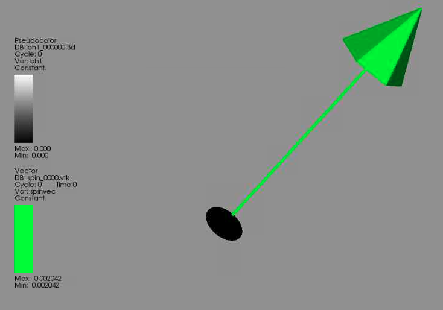
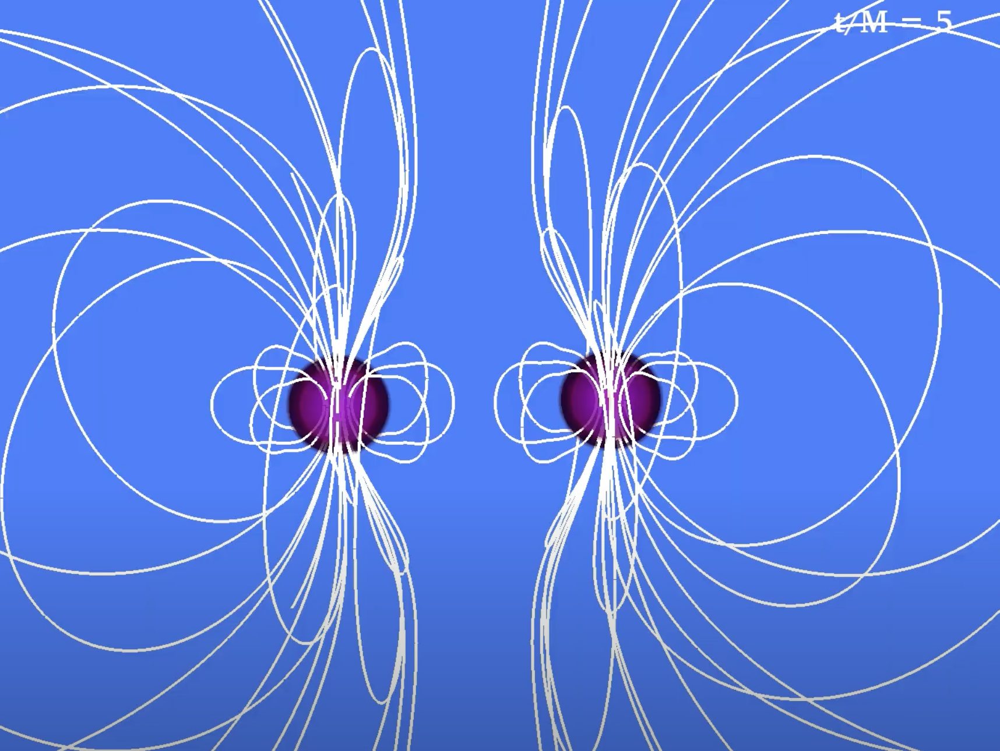
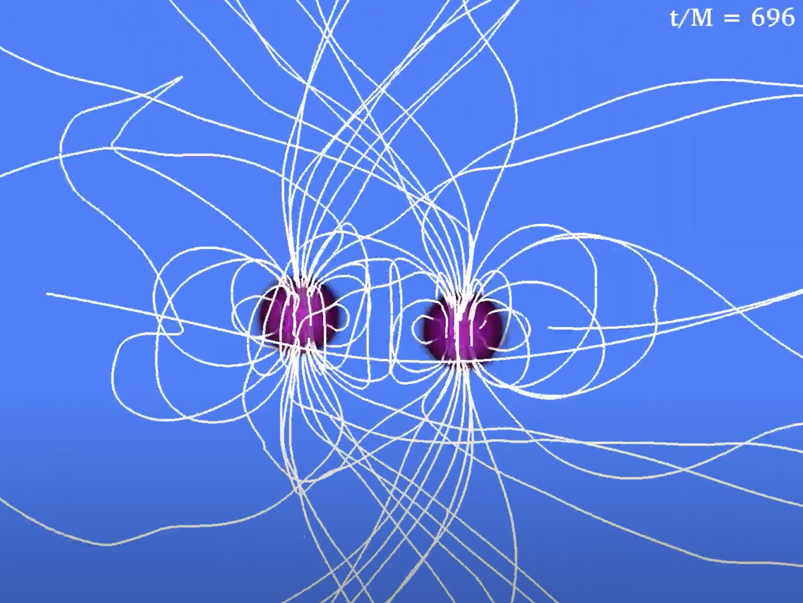
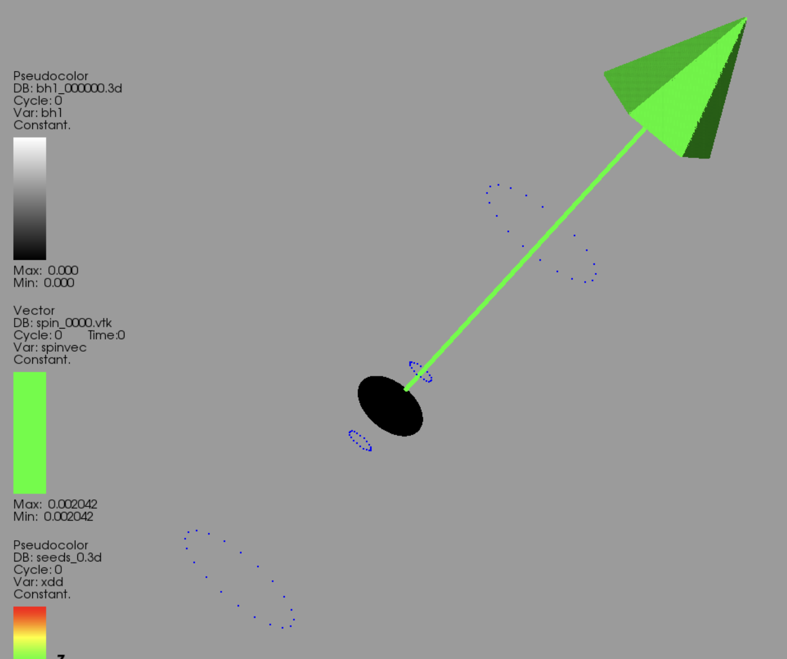
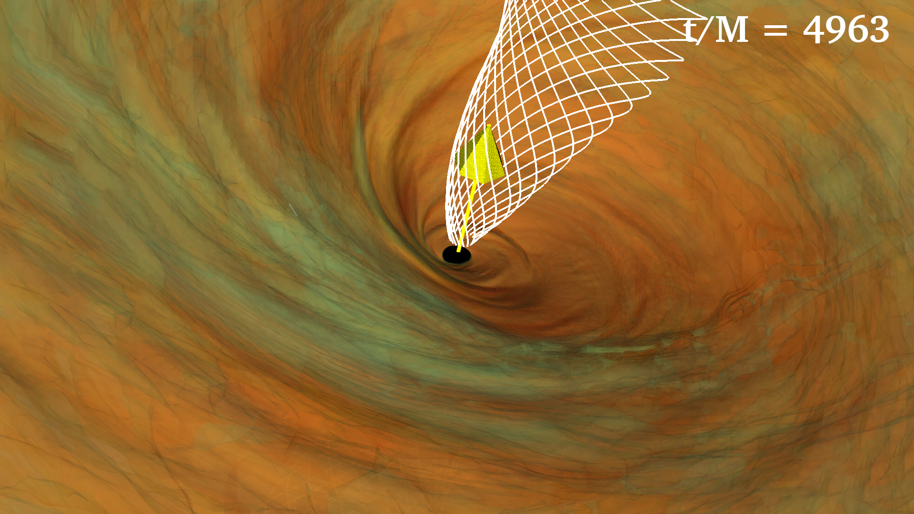
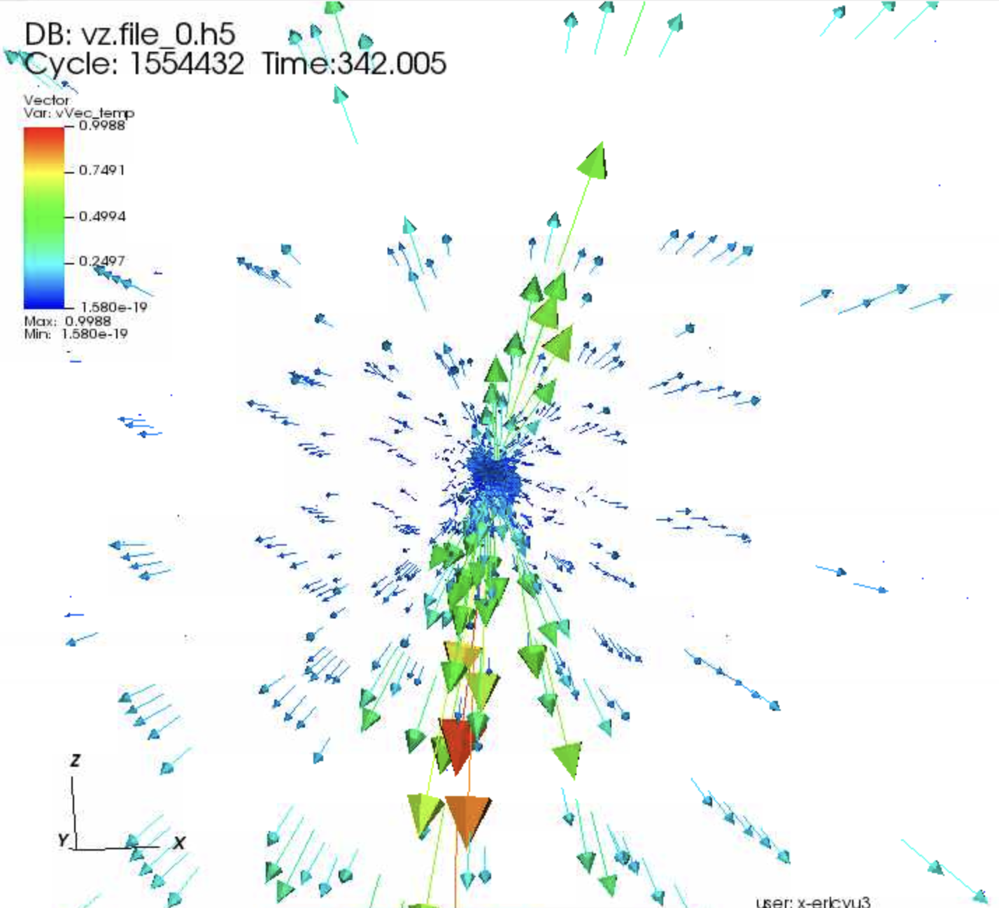
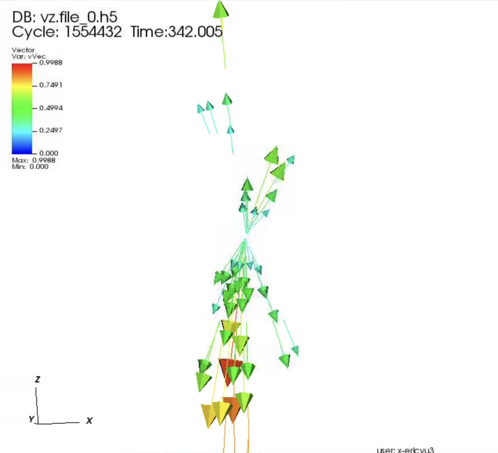
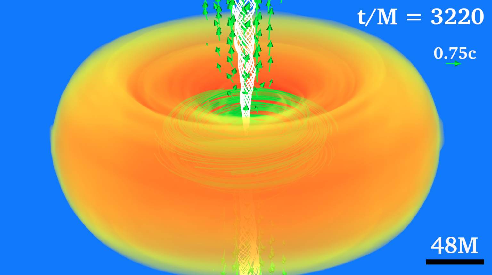

# Typical VisIT Workflow in Numerical Relativity

In this section, we will go over some typical plots you might want to make when visualizing numerical
relativity datasets. Specifically, we will cover general methods that apply to all types of astrophysical
systems before going more in-depth with examples after this section.
We will cover how we visualize black holes and their spin vectors, fluid density fields, fluid
velocity fields, and magnetic fields. The raw data that we use, have been generated by the Illinois
GRMHD code. Three-dimensional HDF5 data can be loaded directly into VisIt, however, some
plots will require some preprocessing before they can visualized in VisIt. In these cases, we will
explain how we process simulation output into something that VisIt can use.

## Black Holes and Spin Vectors

Black holes form an integral component for numerical relativity simulations and being able to plot
them successfully is often a good first check for testing one’s visualization software. The first thing
to do is to preprocess the simulation output into .3d files that can be used by VisIt.
At each time step, the horizon finder in Illinois GRMHD generates an ASCII file named like
h.t120064.ah1.gp. The 120064 corresponds to the iteration number (i.e. the time in the simulation)
and the ah1 is the label for the black hole. For example, in a binary black hole simulation, ah1
ah2 would correspond to the two black holes in the binary and ah3 would be the remnant (once it
appears). These files contain a variety of information about the black hole apparent horizon, but for
visualization purposes, we are only interested in the global x, global y, and global z columns,
which contain a list of (x, y, z) coordinate values that trace the black hole horizon. If you are using
some other code, you will need a horizon finder that outputs a list of points on the horizon surface.
To visualize these points, we want to create a .3d file containing data for a constant scalar field. If
the points we are interested in from the .gp file are (xi, yi, zi) with i ∈ {1, 2, . . . , n} then the
.3d file we want to create will look like

```vtk
1 x y z bh1p
2 x1 y1 z1 0
3 x2 y2 z2 0
4 ...
5 xn yn zn 0
```
<code>bh1.3d</code>
{: style="text-align: center;"}

This creates a constant scalar field with some value (here we choose 0) that is only defined at
points on the black hole horizon. From these, we can visualize the black hole by connecting these
points to form a surface in VisIt and then choosing a color table that maps the value 0 to black.

To visualize this file, the first thing we need to do is to enable the Delaunay operator, which creates a closed surface from our list of points. This operator is disabled by default in VisIt and the
only way to enable it is through the GUI. To do this, navigate to <b>Plugin Manager</b> in the <b>Options</b>
dropdown menu. Then check the box next to <b>Delaunay</b> in the <b>Operators</b> before clicking <b>Apply</b>.
Now, the option will be enabled for your account on the machine you are using. If another user is
using VisIt, they will need to also enable this option. Additionally, if we use a different machine, we
will need to enable this option. We will not need to enable this option every time we launch VisIt on
a given machine, so once we enable it on the GUI, we can access the operator normally in the CLI.

After these steps, plotting the black hole is quite simple. The actual plot we use in VisIt is the
pseudocolor plot, which we then apply the Delaunay operator to. First, load the .3d file, then add
the pseudocolor plot and apply the Delaunay operator. Finally, choose a color table that maps the
value we have chosen for our constant field to black. In our case, the gray color table maps 0 to
black. After talking about the optional spin vector, we will provide a script that does the above
plotting.

To visualize the spin vector of the black hole, we will need a diagnostic file that lists the three
components of the black hole angular momentum (Jx, Jy, Jz ) at each time. To actually visualize the
spin vector, we will use a rather “hacky” method involving the <b>Vector</b> plot. Since VisIt doesn’t
allow us to place vectors by hand, we will create a constant vector field using a .vtk file and then
restrict the plot to a small area around the black hole. The spin vec.vtk file looks like

```vtk
1 # vtk DataFile Version 2.0
2 spin_vector
3 ASCII
4 DATASET STRUCTURED_POINTS
5 DIMENSIONS 3 3 3
6 ORIGIN -30 -30 -30
7 SPACING 30 30 30
8 POINT_DATA 27
9 VECTORS spinvec float
10 Jx Jy Jz
11 Jx Jy Jz
12 ...
```
<code>spin vec.vtk</code>
{: style="text-align: center;"}

where the Jx Jy Jz line is repeated a total of 27 times (since in this .vtk file, we are specifying
a vector field on a 3 × 3 × 3 grid). This essentially creates a uniform vector field with the chosen
values in the region x, y, z ∈ (−30, 30). To plot only one vector on the black hole, you will first need
the “center of mass” (x0, y0, z0) of the black hole, which you can get by averaging all the points in
the .3d file.

To plot the vector in VisIt, open this spin vec.vtk file and add a vector plot. In the vector set-
tings (<b>PlotAtts</b> → <b>Vector</b>), select <b>Uniformly located throughout mesh</b> for <b>Vector placement</b>
in the <b>Vectors</b> tab. Set <b>Color</b> to <b>Constant</b> and select your desired color in the <b>Data</b> tab. Finally,
turn off Autoscale and select your desired scale in the <b>Glyphs</b> tab. Next, add the Box operator
to the Vector plot. In the box operator settings (<b>OpAtts</b> → <b>Selection</b> → <b>Box</b>), select <b>Some</b> for
<b>Amount of cell in the range</b> and set the x, y, z limits to (x0, y0, z0) ± (0.0005, 0.0005, 0.0005).
We choose these numbers based on the grid resolution. This way, only a single vector is plotted at
the center of the box. Below is code that will plot a black hole and its spin vector and you can see
the result in Fig. 40.

```vtk
1 from visit import *
2
3 x0, y0, z0 = 0., 0., 0. #center of mass of black hole
4 OpenDatabase("/path/to/bh1.3d")
5 OpenDatabase("/path/to/spinvec.vtk")
6 ActivateDatabase("/path/to/bh1.3d")
7 AddPlot("Pseudocolor", "bh1p") #plot index 0
8 ActivateDatabase("/path/to/spinvec.vtk")
9 AddPlot("Vector", "spinvec") #plot index 1
10 SetActivePlots(0) #only apply options/operators to bh1 plot
11 Pseudo = PseudocolorAttributes(); Pseudo.colorTableName = "gray"
12 SetPlotOptions(Pseudo)
13 AddOperator("Delaunay")
14 SetActivePlots(1) #only apply options/operators to spinvec plot
15 Vec = VectorAttributes(); Vec.glyphLocation = Vec.UniformInSpace
16 Vec.autoScale = 0; Vec.scale = 110; Vec.colorByMag = 0 #constant color
17 Vec.vectorColor = (0, 255, 0, 255) #green
18 SetPlotOptions(Vec)
19 AddOperator("Box")
20 BoxAtts = BoxAttributes()
21 BoxAtts.minx = x0 - 0.0005; BoxAtts.maxx = x0 + 0.0005
22 BoxAtts.miny = y0 - 0.0005; BoxAtts.maxy = y0 + 0.0005
23 BoxAtts.minz = z0 - 0.0005; BoxAtts.maxz = z0 + 0.0005
24 SetOperatorOptions(BoxAtts)
25 a = AnnotationAttributes()
26 a.backgroundMode = a . Solid; a.backgroundColor = (155, 155, 155, 255)
27 SetAnnotationAttributes(a)
28 c = View3DAttributes()
29 c.viewNormal = (0.5, -1, 0); c.imageZoom = 300; c.viewUp = (0, 0, 1)
30 SetView3D(c)
31 s = SaveWindowAttributes()
32 s.format = s.PNG; s.outputToCurrentDirectory = 1
33 s.fileName = "/path/to/output"
34 SetSaveWindowAttributes(s)
35 DrawPlots(); SaveWindow()
```
Plotting a black hole with a spin vector
{: style="text-align: center;"}


<div style="text-align: center;">
    <p>Figure 40: A tilted black hole with its spin vector. The black ellipse is the apparent horizon.</p>
</div>


## Density

A core aspect of numerical relativity simulations are the fluid dynamics of the system. Therefore,
accurately plotting the behavior of the fluid is critical to gaining insight into the simulation’s evolution.
To plot the fluid density, we either use the <b>Isosurface</b> operator applied to the <b>Pseudocolor</b> plot
(Sec. 4.2.2) or the <b>Volume</b> plot (Sec. 4.2.1).

In this section, we will focus on how to use these rendering techniques to best showcase numerical
relativity data. The Illinois GRMHD code outputs the fluid density data as HDF5 scalar data
named rho b. When plotting this data, we will first consider the color table. The color table is
important since it determines what the fluid density—which we’ve used to probe accretion disks and
neutron stars—will look like in the final visualization. By choosing the color table, we choose the
color assigned to each density value. When choosing a color table, the goal (aside from aesthetics)
is to be able to differentiate between different density values in the final image. Refer to Sec. 4.2.2,
Sec. 4.4 for information related to creating and exploring a color table.

Once we have a color table, it is then processed by VisIt through another .xml file, which contains
information on how the pseudocolor will be plotted onto the data within the visualization, as seen be-
low. A full example of the pseudocolor XML file can be found at <a href="https://github.com/tsokaros/Illinois-NR-VisIt-Guide/blob/main/sec_5/rho_pseudo.xml"><code>VisIt-Guide/sec 5/rho_pseudo.xml</code></a>

```vtk
1 <?xml version="1.0"?>
2 <Object name="PseudocolorAttributes">
3 <Field name="minFlag" type="bool">true</Field>
4 <Field name="min" type="double">-4</Field>
5 <Field name="maxFlag" type="bool">true</Field>
6 <Field name="max" type="double">-0.001</Field>
7 <Field name="colorTableName" type="string">bhbhdisk</Field>
8 <Field name="opacityType" type="string">ColorTable</Field>
9 <Field name="opacityVariable" type="string">logrho</Field>
10 <Field name="opacityVarMin" type="double">-4</Field>
11 <Field name="opacityVarMax" type="double">-0.001</Field>
12 ...
13 </Object>
```
<code>rho_pseudo.xml</code>
{: style="text-align: center;"}

There are several interesting attributes to be aware of within this xml file, as they will directly
influence the resultant visualization. Starting from the top of the xml file, the min and max fields
directly correspond to the maximum and minimum values in which the colorbar will interpolate its
values as mentioned above. The colorTableName field refers to the color table that VisIt will use
within its pseudoplots as found within the /home/<i>USERNAME</i>/.VisIt directory. The opacityType
field corresponds to where VisIt will pull the opacity value mapping within the modeling process.
Generally speaking, the minFlag, maxFlag, opacityVarMinFlag, opacityVarMaxFlag fields should
be set to False; however it can also provide useful information during the visualization development
process.

### Isosurface 
During the isosurface rendering process, there are different considerations one needs to take into
account. The following is an example of an XML that controls the configuration surrounding the
isosurface rendering operator:

```vtk
1 <?xml version="1.0"?>
2 <Object name="IsosurfaceAttributes">
3 <Field name="contourNLevels" type="int">21</Field>
4 <Field name="contourValue" type="doubleVector">-2.6
5 -2.5 -2.4 -2.3 -2.2 -2.1 -2.0 -1.9 -1.8 -1.7 -1.6 -1.5
6 -1.4 -1.3 -1.2 -1.1 -1.0 -0.9 -0.8 -0.7 -0.6</Field>
7 <Field name="contourPercent" type="doubleVector">0.1</Field>
8 <Field name="contourMethod" type="string">Value</Field>
9 <Field name="variable" type="string">logrho</Field>
10 ...
```
<code>iso.xml</code>
{: style="text-align: center;"}

The first field parameter to note in this xml file is the contourMethod field. Essentially building
off the concepts discussed within Sec. 4.2.2, this field parameter lets VisIt know what method
it should use when calculating the contour shells within the model’s visualization. There are
two methods that VisIt uses in order to generate the shells or the levels within the visualization:
Percentage and Value. With the Percentage parameter, VisIt will interpolate the different contour
levels by dividing the range between the minimum/maximum density by either a percentage set
by the user or interpolation. Alternatively, the Value parameter will allow the user to set which
specific values within data to create contour shells as seen within the contourValue field, giving the
user more control over their model. Generally speaking, the greater the quantity of shells within a
visualization, the higher the quality of the image, so be sure to assess the computational capabilities
at hand when creating these figures. Visualizations in numerical relativity are usually created on
high performance computing systems due to the volume of data and computational intensity of the
tasks. Experimenting to understand the limits of the high performance computing systems is vital
to the efficiency in the visualization tasks. Knowing exactly how long a visualization might take to
complete as well as the resources used within the visualization process is especially important to
the visualization process.

We lay out the VisIt-CLI code for creating and loading up isosurface and pseudocolor attribute
files shown within the following python script:

```vtk
1 from visit import *
2
3 # plotting density data with isosurface rendering
4
5
6 #adding the pseudocolorplot
7 # loading the density data into visit
8 densityplot = ActivateDatabase(Path_to_Density_data)
9
10 #loading up the pseudocolorplot xml settings into the plot
11 #-> GUI equivilant to changing the Pseudocolor plot settings
12 #through the dropdown menu
13 LoadAttribute(Path_to_Pseudocolor_plot_xmlfile, densityplot)
14
15 # adding the pseudocolor plot
16 AddPlot("Pseudocolor", "density")
17 SetActivePlots(plot_idxs.index("density"))
18 #loading up plotting data
19 SetPlotOptions(densityplot)
20
21 # Adding the Isosurface operator
22
23 #loading in the isosurface operator
24 iso = IsosurfaceAttributes()
25 #adding isosurface operator settings
26 LoadAttribute(Path_to_iso_xml, iso)
27 #adding operator to plot
28 AddOperator("Isosurface")
29 #making sure the plot has the operator xml settings
30 SetOperatorOptions(iso)
```
Code Listing 5.2.1:<code>plot_density_isosurface.py</code>
{: style="text-align: center;"}


### Volume

Similar to the isosurface rendering plot, the volume rendering plot is also primarily controlled
through the volume rendering xml settings in Sec. 4.2.1. The following is an example xml file that
controls the volume rendering plot configurations:

```vtk
1 <?xml version="1.0"?>
2 <Object name="VolumeAttributes">
3 <Field name="legendFlag" type="bool">false</Field>
4 <Field name="lightingFlag" type="bool">false</Field>
5 <Field name="opacityAttenuation" type="float">1</Field>
6 <Field name="samplesPerRay" type="int">1000</Field>
7 <Object name="colorControlPoints">
8 <Object name="ColorControlPointList">
9 <Object name="ColorControlPoint">
10 <Field name="colors" type="unsignedCharArray"
11 length="4"> 255 255 255 255 </Field>
12 <Field name="position" type="float">0</Field>
13 </Object>
14 ...
```
<code>iso.xml</code>
{: style="text-align: center;"}

Breaking down the important attributes of this xml file, there are several important field
parameters and considerations to make during the visualization development process. As mentioned
previously, the colorControlPointList field parameter controls the pseudocolor plot within the
volume rendering plot, delineating the different density values across the plot. The samplesPerRay
parameter controls the overall quality of the image, as the smoothness and resolution of the plot
is proportional to the magnitude of this field parameter. However, it should be duly noted that
volume rendering is a computationally taxing operation to conduct, with this process being nearly
ten times more resource intensive than isosurface rendering. Therefore, the operation becomes
exponentially more computationally intensive with a higher magnitude of samplesPerRay, so
be weary of the capabilities of the high performance computing systems when developing these
visualizations. Adjusting the opacityAttenuation will also influence the overall transparency of
the disk at the cost of computational intensity within the visualization. Generally speaking, it may
be useful to adjust the colorbar and viewing angle through different rendering techniques before
experimenting with the volume renderings in order to understand how different iterations of the
visualization may appear.

We use the volume attributes as shown in the volume rendering section.

```vtk
1 from visit import *
2
3
4 # volume rendering in VisIT
5
6 #loading in the density data into VisIT
7 ActivateDatabase(path_to_density_data)
8 #creating an instance where we could set the volume attributes
9 density_atts = VolumeAttributes()
10 #loading in our xml settings for the density attributes
11 LoadAttribute(path_to_volume_xml_file, density_atts)
12 #creating a volume plot with the logrho variable
13 AddPlot("Volume", "logrho")
14 SetActivePlots(plot_idxs.index("density"))
15 #making sure the volume plot has the proper settings
16 SetPlotOptions(rho_atts)
```
Code Listing 5.2.2:<code>plot_density_volume.py</code>
{: style="text-align: center;"}


## Magnetic Field Lines

Streamlines (or integral curves) are the plots that we use to visualize the magnetic field in GRMHD
simulation data. This is because the <b>IntegralCurve</b> plot allows you to specify the exact locations
of the seed points from which VisIt will integrate. The general information pertaining to the
<b>IntegralCurve</b> plot, such as the important attributes, can be found in section 4.2.4. This section
will instead focus on how to choose seed points to create magnetic field lines that reveal important
physics in the simulation data.

The Illinois GRMHD code outputs the magnetic field data as three HDF5 scalar fields Bx, By,
Bz. To combine these into a vector field in VisIt, follow the directions in section 4.3. Similarly, the
process of drawing field lines is the same as specified in section 4.2.4. We use two methods to draw
magnetic field lines: particle seeds and grid seeds.


### Particle Seeds

In GRMHD magnetic field lines are attached to particles of matter (i.e. the field lines are ”frozen
in” to the matter particles). Whenever a particle of matter moves, then the magnetic field line
should move with it. For example, the magnetic field lines in a magnetized rotating neutron star
would rotate with the star. The Illinois GRMHD code keeps track of the x, y, and z positions
of a selected group of n fluid particles (n is usually chosen to be between 1000 and 10, 000) at every iteration: {(xi(t), yi(t), zi(t))}n
i=1. These locations are tracked by integrating an initial set of
particles {(xi(0), yi(0), zi(0))}n
i=1 along the fluid velocity field.

In order to visualize a magnetic field line that follows the motion of the fluid—as it should—we
use the locations of particles as seed points for our magnetic field lines. The simulation outputs the
positions of n particles at all times {(xi(t), yi(t), zi(t))}n
i=1 so we have a large option of particles
to choose from. In practice, we don’t draw field lines with all n particles, but instead choose
a subset of m particles to follow (usually m < 100 but it depends on the system) These m
particles are chosen so that the magnetic field lines drawn at the initial time t = 0 using the seeds
{(xik (0), yik (0), zik (0))}m
k=1 represent the physics that we want to probe on. Then the positions of
these m particles are used to seed the magnetic field lines in all subsequent frames t ≥ 0. As a
result, the magnetic field lines drawn follow the flow of the matter. Fig. 41 shows a binary neutron
star simulation with magnetic field lines at two times t/M=5 and t/M=696. At t/M=5, which is close
to the initial time t/M=0, the magnetic field lines look dipole like and showcase the magnetic field
present in the binary system. Then at t/M=696, notice how the magnetic field lines are still seeded
from within the two neutron stars. If we don’t use particle seeds to seed magnetic field lines here,
then the visualized magnetic fields wouldn’t follow the neutron stars as they inspiral.




<div style="text-align: center;">
    <p>Figure 41: Particle seeded field lines in binary neutron stars</p>
</div>

The process of choosing which particles to follow—as mentioned earlier—comes down to choosing
which particles at t = 0 create a visualization that best showcases the physics of the system. The
initial magnetic fields in numerical relativity simulations of merging neutron stars are commonly
poloidal. Additionally, if the object that this magnetic field permeates has nonzero angular
momentum, the angular momentum or spin axis usually is in alignment with the axis of the
poloidal magnetic field. For this reason, we usually choose particles that form rings around this
spin/magnetic-field axis. For example, each neutron star in the binary neutron star system of Fig.
41 initially has a poloidal magnetic field axis pointing in the vertical direction (±ˆz). Then we choose
rings of points that lie in the xy-plane, which is orthogonal to the magnetic field axis. On the left
panel of Fig. 41, the collection of smaller magnetic field line loops close to each neutron are created
by a ring of points inside the neutron star with a larger radius. The field lines that extend further from the stars are created by a ring of points inside the neutron star with a smaller radius.

Choosing the seed point rings that create nice visualizations still requires experimentation. Below
in Code Lst. 5.3.1 (which can be found at VisIt-Guide/sec_5/seed_maker.py ), we provide a
simple Python code that can draw these types of rings. There are options to choose where the rings
are centered as well as the direction of the spin/magnetic-field axis. Below, we provide a summary
of the different parameters of this script.

<ul>
   <li><code>centers</code>: Center of the compact object</code> 
This parameter is found in line 4 of seed_maker.py. It consists of a list of 3-tuples (each
entry is a float) where each 3-tuple is the center of the compact object you want to place field
lines around.</li>

   <li><code>pairs</code>: Radius, height pairs that describe the ring</code> 
This parameter is found in line 5 of seed_maker.py. It consists of a list of 2-tuples (each
entry is a float). Each 2-tuple is of the form (radius, height). The radius specifies the
radius of the ring and the height specifies the height of the ring with respect to the spin axis.</li>

   <li><code>spins</code>: Axis that rings are orthogonal to</code> 
This parameter is found in line 6 of seed_maker.py. It consists of a list of 3-tuples (each
entry is a float) where each 3-tuple specifies the axis we want the ring of seed points to be
orthogonal to. This axis usually coincides with the angular momentum axis (e.g. the spin axis
of a black hole).</li>

   <li><code>num_seeds_per_ring:</code>: Number of seeds per ring</code> 
This parameter is found in line 7 of seed_maker.py. It consists of a list of integers that specify
the number of seeds in each ring</li>


   <li><code>centers</code>: Adjusts smoothness and resolution of plot</code> 
As mentioned before, ray casting creates the plot by shooting rays and sampling the points
in its path. By increasing the number of samples that are being cast through the data for
each ray, we are able to improve the overall quality of the image. Having too few sample
points along a ray gives rise to sampling artifacts such as rings or voids and decreases the
overall ”smoothness”. However, sampling more points takes longer to render. We observe a
1:1 correlation between changes in image rendering time and the number of samples per ray.</li>

   <li><code>offsets</code>: An angle to offset the seed placement</code> 
This parameter is found in line 8 of seed_maker.py. It consists of a list of floats. These
numbers specify an offset in the position of the individual points on the ring. Adding an offset
of π would rotate the points on the ring by 180◦.</li>

   <li><code>reflectZ</code>: Reflect seeds across equatorial plane</code> 
Turning on this parameter reflects all the seeds across the equatorial plane. This equatorial
plane is the plane orthogonal to the spin axis.</li>
</ul>

```vtk
1 import numpy as np
2
3 # centers, pairs, spins, num_seeds_per_ring must have same length
4 centers = [(0., 0., 0.), (0., 0., 0.)] # list of 3-tuple centers (x, y, z)
5 pairs = [(3.0, 1.), (1., 1.)] # list of 2-tuple pairs(radius, height)
6 spins = [(0., 0., 1.), (0., 0., 1.)] # list of 3-tuple spins (Jx, Jy, Jz)
7 num_seeds_per_ring = [8, 8] # list of ints number of seeds per ring
8 offsets = [np.pi/8, np.pi/8] # offset in the angles of phi chosen
9 reflectZ = True
10
11 with open("seeds_0.txt","w+") as f:
12 f.write("{} {} {}\n".format("x", "y", "z"))
13 for cen, pair, spin, num_steps, offset in zip(centers, pairs, spins,
num_seeds_per_ring, offsets):
14 r, h = pair
15 spin_vec = np.array(spin); cen_vec = np.array(cen)
16 spin_vec /= np.linalg.norm(spin_vec)
17 u_vec = np.array([51., 50., 49.]) #random vector not parallel to
spin
18 u_vec /= np.linalg.norm(u_vec)
19 #gram schmidt step
20 u_vec = u_vec - ( np.dot(u_vec, spin_vec) / np.dot(spin_vec,
spin_vec ))*spin_vec
21 v_vec = np.cross(spin_vec, u_vec)
22 for phi in np.linspace(0 + offset, 2*np.pi + offset, num_steps,
endpoint=False):
23 c = r*np.cos(phi); s = r*np.sin(phi)
24 p1 = cen_vec + c*u_vec + s*v_vec + h*spin_vec
25 f.write("{} {} {} {}\n".format(str(p1[0]), str(p1[1]), str(p1
[2])))
26 if reflectZ:
27 p2 = cen_vec + c*u_vec + s*v_vec - h*spin_vec
28 f.write("{} {} {} {}\n".format(str(p2[0]), str(p2[1]), str
(p2[2])))
```
Code Listing 5.3.1<code>seed maker.py</code>
{: style="text-align: center;"}



<div style="text-align: center;">
    <p>Figure 42: Seed point rings orthogonal to spin</p>
</div>

Two rings of a specified radius are generated at a specified height above and below the plane
orthogonal to the spin axis. As an example, in Fig. 42, four rings that lie on planes orthogonal to the spin vector of a tilted black hole are shown.

Now we need to find which particle seeds among the total number of n seeds are closest to our
chosen idealized seed points. This can be done by using a nearest-neighbor search using a K-D tree.
In Python, you can load all the particles into scipy.spatial.KDTree and use the query method
to return the nearest particle to an input point. After you choose the set of particles closest to
your chosen seed points, you can use this set of particles to seed the magnetic field lines for the
remainder of the simulation data.

### Grid Seeds

While particle seeds are used to visualize the magnetic field in fluids such as neutron stars or
accretion disks, we don’t use them to visualize the magnetic field lines extending from the poles
of black holes, since particles there are either captured or escape in jets. For black holes, we use
grid points, which are just points we choose around the black hole that aren’t attached to any fluid
particles. To capture a potential jet, we choose points around black holes in a similar fashion to the
way we choose idealized seed points. In particular, we want to draw two rings of seed points above
and below the plane orthogonal to the spin axis of the black hole. Fig. 43 shows a spinning black
hole surrounded by a gaseous accretion disk with twisted magnetic field lines seeded by a ring of
points above the black hole. Throughout the evolution, make sure to have these rings of seed points
follow the position and the spin of the black hole.
When integrating these grid seeds that are around a black hole, make sure that the integrationDirection
is not set to Both. We don’t want the field lines to integrate into the black hole horizon. To do this,
create a separate plot for the field lines above and below the black hole. For each of these plots, try setting the integrationDirection to different combinations of Forward and Backward so make
sure the field lines integrate away from the horizon.


<div style="text-align: center;">
    <p>Figure 43: Grid point seeded field lines above black hole</p>
</div>


Explicit examples and code that magnetic field lines seeded by particles and grid points can be
found in the case studies later in the guide (Sec. 6, Sec. 7.3).


## Fluid Velocity Arrows

We use the Vector plot (introduced in section 4.2.3) to visualize the fluid velocity vector field in
GRMHD simulation data. We choose to use this plot rather than a streamline plot since it allows us
to assess the behavior of the velocity field in areas of interest. For example, to determine if there is
an incipient relativistic jet in a region that contains collimated magnetic fields, all of the velocities
should be pointing in the direction of the jet. A vector plot allows us to populate the area of interest
with many vectors pointing in the direction of the fluid velocity field. By looking at the behavior of
these arrows, we can determine if the behavior of the fluid velocity fields matches our hypothesis.

Like the magnetic field, the Illinois GRMHD code outputs the fluid velocity field data as three
HDF5 scalar fields vx, vy, vz. By itself, the vector plot will place vectors of all magnitudes all over
the grid. In numerical relativity, we are mostly interested in relativistic velocities in specific areas,
as for example where a jet may form. We will use a combination of expressions and operators to plot
the arrows we are interested in. These steps are often quite involved and require experimentation to
get them right. For this reason, we usually only make vector plots of the fluid velocity at a handful
of interesting times, rather than for a movie of the entire evolution.

```vtk
1 #combining vx, vy, vz into vector expression
2 DefineVectorExpression("vVec_temp","{vx,vy,vz}")
3
4 #if magnitude(vVec_temp) > 0.5, use original data,
5 #else, set to {0,0,0}
6 DefineVectorExpression("vVec","if(gt(magnitude(vVec_temp), \
7 0.5), vVec_temp, {0,0,0})")
8
9 # below: only show arrows where the
10 #log(b^2/2*rho) plot is larger than -0.5
11 DefineVectorExpression("vVec","if(gt(logbsq2r, -0.5), \
12 vVec_temp, {0,0,0})")
```
Code Listing 5.4: Restricting velocity plot
{: style="text-align: center;"}

After loading in the three scalar fields and combining them into a vector expression, new
expressions can be created. For example, vectors can be filtered out based on their magnitude. On
line 3 of the code listing above (Code Lst. 5.4), vectors with magnitudes less than 0.5c are set to
zero so that only the relativistic velocities > 0.5c are shown. This number is arbitrary and can
be changed to suit ones needs. Vectors can also be filtered out based on the values of other plots.
For example, jets form in areas where the force-free parameter b2 /(2ρ0 ) (see Sec. 7.4) is greater
than some cutoff bigger than unity, so we might want to only plot vectors in these areas. On line
␁
5, vectors in areas where log b2 /(2ρ0 ) are less than −0.5 are set to zero. Note that to do this
comparison, you will also need to load and define the logbsq2r scalar field. Note that in Code Lst.
5.4, we only choose to use one of the restrictions, so only one of lines 6 and 7 or 11 and 12 should
be used.


<div style="text-align: center;">
    <p>Figure 44: Restricting a vector plot of fluid velocity</p>
</div>


<div style="text-align: center;">
    <p>Figure 44: Restricting a vector plot of fluid velocity</p>
</div>

Once the vector data is loaded and filtered using expressions (if desired), selection operators
can be added to the plot to restrict the plot to a physical region. On the GUI, these can be found
in Operators → Selection. There are only a limited amount of options, but multiple selection
operators can be applied if desired. The Box/Cylinder restricts the plot to the region inside (or
outside if the Inverse option is selected) the shape. There is also a Clip operator, which can restrict
the plot to inside or outside a sphere, or to one side of a plane. Below, there is an example of a
vector plot of fluid velocity data from a GRMHD simulation before and after applying expressions
and slicing operators (Fig. 44). Specifically, all vectors with magnitude less than 0.25c were set to
zero and the plot was restricted to inside a cylinder that lies along the vertical axis.

During this process of selecting different regions with selection operators, make sure you
are also experimenting with the different vector attribute settings. Since GRMHD simulations
commonly use finer grids in areas around compact objects, like black holes or neutron stars, the
AdaptsToMeshResolution setting will place more arrows in the areas with a finer grid (as you can see in Fig. 44). So switching to UniformInSpace might give better results. If you find that different
combinations of selection operators and vector settings don’t give you a satisfactory visualization,
another method is to create multiple vector plots using the same data. Then you can apply different
operators and have different settings for different regions. Below is a visualization example that
uses vector fluid velocity plots to visualize the relativistic jet following a binary black hole merger
(Fig. 45). Explicit examples and code that visualize fluid velocity arrows can be found in the case
studies later in the guide (see Sec. 7.4).

In the following sections we will apply the knowledge we learned by walking through the steps
taken to create visualizations from a select cases of GRMHD simulations done by the Illinois
Relativity Group.


<div style="text-align: center;">
    <p>Figure 45: Visualization with fluid velocity arrows</p>
</div>

