# Case Study: Black Hole with Accretion Disk
The second case study will be of a black hole surrounded by an accretion disk, which we will refer to
in this section as a BH-disk (BHD). BHDs can be found in active galactic nuclei or in the aftermath
of binary neutron star mergers. The BHD data we will use in this section will be of a rapidly
spinning black hole surrounded by a self-gravitating accretion disk where the spin of the BH is tilted
with respect to the angular momentum of the disk. The accretion disk is seeded with a poloidal
magnetic field. As matter accretes onto the BH, a relativistic jet develops. Visualizations of the
BHD use the following simulation output databases:

<ul>
    <li><code>rho_b.file_*.h5:</code> HDF5 data of the fluid rest-mass density $\rho_0$</li>
    <li><code>Bx.file *.h5, By.file *.h5, Bz.file *.h5:</code> HDF5 data of the magnetic field</li>
    <li><code>vx.file *.h5, vy.file *.h5, vz.file *.h5:</code> HDF5 data of the fluid velocity</li>
    <li><code>smallb2.file *.h5:</code>  HDF5 data of b2 ≡ B2/(4π) where B is the magnitude of the magnetic field.</li>
    <li><code>h.t*.ah1.gp:</code> Horizon data that lists a set of points on the apparent horizon of the black hole.</li>
    <li><code>BH diagnostics.ah1.gp:</code>  ASCII black hole diagnostic file containing information about the
apparent horizon of the black hole.</li>
    <li><code>BHspin.mon:</code> ASCII file containing the black hole spin vector at each iteration</li>
</ul>

In this case study, we will focus on visualizations of the density, which was glossed over when we
made visualizations of the magnetars in Sec. 6. We will go over in detail how to find good settings
for visualizing the density using both isosurface and volume rendering techniques.

## Isosurface Rendering of Disk
Using the databases mentioned above, we will make the following plots.

<ul>
    <li><b>Isosurface</b> of <b>Volume</b> plot of log$\left(\frac{\rho_0}{\rho_0(0)}\right)$, which will visualize the accretion disk.</li>
    <li><b>Pseudocolor</b> plot  of the apparent horizon of the black hole.</li>
    <li><b>Vector</b> plot of the black hole spin.</li>
</ul>

This section focuses on designing the BHD visualizations seen within in Figs. 50 and 51. There
were a number of different visualization parameter decisions with their respective trade-offs made
within this figures. To begin with, we created these visualizations using isosurface rendering as
described in Sec. 4.2.2, utilizing layers of shells to model the different density values. Volume
rendering is a more computational intensive operation in comparison to isosurface rendering, and isosurface rendering allows for a lot more flexibility when iterating through the visualization
development process. The salient features for isosurface and volume rendering have been discussed
in Sec. 4.2.2 and Sec. 4.2.1. Here we will discuss specific details regarding the visualization of BHDs
using isosurface rendering.

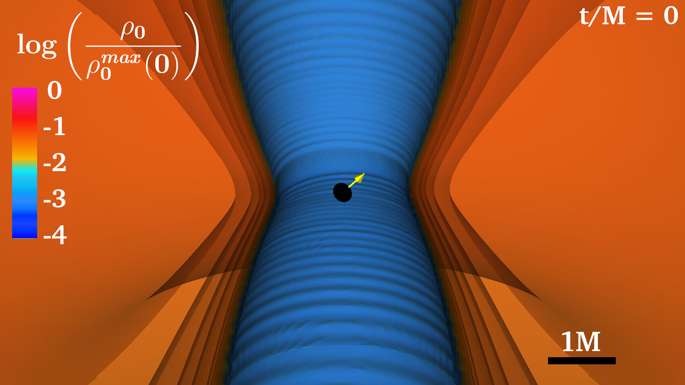

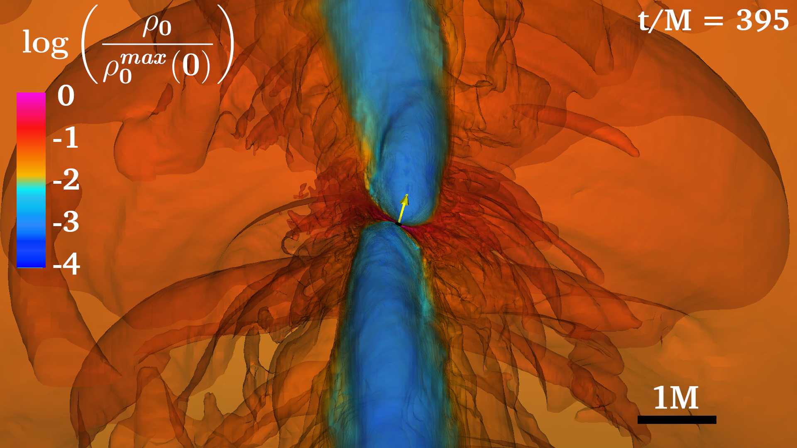

    
Figure 50: Isosurface zoom in of a massive BHD. At t = 0 the angular momentum of the disk is
along the z axis, while the spin of the black hole (yellow arrow) is at 45◦
from the z axis.

    
Figure 51: Isosurface zoom out of the massive BHD of Fig. 50

Starting with the shells, the number amount of them and their distribution across the data play a
vital role in what information is highlighted within the visualization. Within this simulation, there is
significant variation in the fluid density within the inner torus of the BHD. Through experimentation,
we found that there was quite a bit of fluid movement and variation for the fluid density values
between -1 to -2 (log scale), therefore adding more shells within this region, can better communicate
the fluid dynamics across the evolution. In the same light, the following parameters are different
characteristics to be considered in order to maximize the information communicated:

<ol>
   <li><u><code>min and max</code>: Disk size:</u>
Since we normalize our colorbar with the nital maximum density and take the logarithm of
the resulting ratio, 0 reflects the maximum density value of the disk (typically found close
to the disk). For the lower bound, we are typically interested in density values that are of
the order 3 or 4 decades smaller than the maximum density. The magnitude of the minimum
colorbar density is directly correlated to the size of the disk being visualized. This parameter
can be adjusted within the isosurface and colorbar XML file as mentioned in Sec. 5.2.1
</li>
</ol>

<ol start="2">
</li> 
   <li><u><code>contourNLevels</code>: Resolution of visualization</u>
   Having more shells leads to sharper images, since we are able to capture more densities but the
trade off is disk opacity. The more shells we have, the harder it is to keep the disk transparent
and track all of the layers in one image. Fortunately, we found that the solution to this
problem is to experiment with lighter colors and different opacity gradients as controlled
within the colorbar, which we will review in later sections.
</li>
   <li><u><code>contourValue</code>: Disk smoothness</u>
As previously mentioned, there are usually specific regions of density that are more interesting
and have more information to communicate than others, so focusing on creating more shells
within this region of the data can be crucial to creating high quality visualizations. Unfortunately, there is no magic formula to figure out exactly what those regions of interest might be
without iterating through different models and experimenting to see what shell configurations
work best.
</li> 
    <li><u><code>imageZoom and viewNormal:</code>: Perspective of disk</u>
The camera angle of the disk itself is crucial to what the visualization focuses on, as discussed
within Sec. 4.5. Different levels of zoom and angles of the disk influence which information is
largely communicated by the visualization, so experimenting on this end to figure out which
perspective from the camera angle lends itself to a better visualization is something to consider
when creating high quality visualizations. When modeling the visualization, it can be useful
to think about what information should be communicated through the visualization, and let
that guide the visualization process. For instance, Fig. 51 communicates the fluid dynamics
of the outer torus and the overall disk across the evolution, whereas Fig. 50 communicates
information regarding the fluid dynamics of the inner torus.
</ol>

Custom colorbars can be created and stored within the ∼/.visit directory. As mentioned
before hand in Sec. 5.2, the colorbar is created through an xml based file with the .ct file extension.
Utilizing this feature, we create our own colorbars in order to bring more depth to the visualization
and highlight different attributes, as seen within the template colorbar attached within the github.
The following considerations were made when creating the colorbar:

<ol>
   <li><u><code>ColorControlPoint</code>: Clarity of visualization:</u>
Within this case, since there are 21 shells across the BHD, VisIt will interpolate the correspond￾ing values within the colorbar and assign the color to the density value. As more shells are
created within the visualization, it becomes increasingly more important to consider how the
colorbar is structured in order to best communicate information within the visualization. After
experimenting with different color schemes, it was found that darker colors with a limited color
spectrum failed to highlight the different density shells. Although the visualization showed the
overall variation in density, the minute details on how different layers of the structure change
throughout the evolution was lost to the viewer. Incorporating a lighter color and opacity
gradient across the pseudo-color plot allowed for more of the internal structures of the BHD
to be displayed, allowing the communication of low-level information about the composition
of the system.
</li>
</ol>

<ol start="2">
</li> 
   <li><u><code>ColorControlPointList</code>: Dynamics of density value :</u>
   The spectrum of colors within the visualization should also be proportional to the magnitude
of different colors packed within the colorbar. With a large number of shells being added to
the visualization, there will be a lot more information that could be communicated to the
viewer to show the dynamics of the torus throughout the evolution.
</li>
   <li><u><code>ColorControlPoint</code>: Distribution of density values :</u>
As mentioned beforehand, we can set distinct colors across the colorbar and VisIt will
automatically interpolate between the different values in order to generate the colorbar. From
here, VisIt will assign different color values to the corresponding shells within the isosurface
rendering process. Leveraging this fact, it is important to be cognizant of what pockets of
density values might be more important than others, so that more variation of colors are
created in that region. In general, creating more color points can create more control over the
smoothness between the difference colors across the colorbar.
</ol>

In order to better understand the thought process behind these choice s, we can take a look at
some of the iterations through the visualization process. To begin, we first visualized the black hole
with a limited color table (Fig. 52), from dark red to orange, that did not show the details in the
shell variation as shown in Fig. 50.

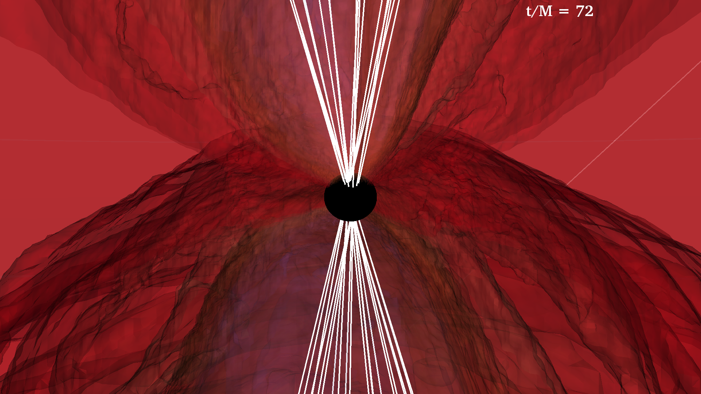

    
Figure 52: Black hole-disk visualization using a limited color table.

Using this colorbar, the different shells within the disk around the black hole seem to merge
together and are very difficult to distinguish. In order to better bring out the density distribution,
we incorporate in Fig. 53 a wider spectrum of lighter colors with a corresponding opacity gradient
that allowed for lighter densities to have more transparency in order to better highlight the internal
structures of the jets and variation of densities.

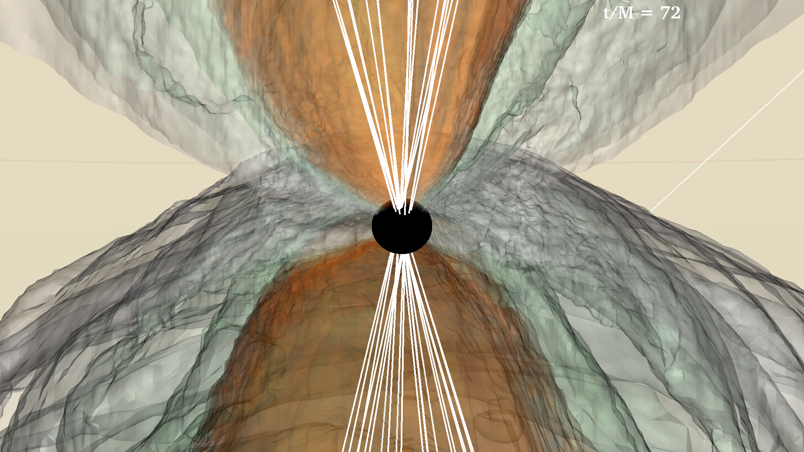

    
Figure 53: Black hole-disk visualization with improved color table.

## Volume Rendering of Disk

In this section, we will make volume rendering of the same BHD data used in Sec. 7.1. Fig. 56
is created using volume rendering by utilizing ray tracing modeling techniques in order to create
high-quality 3-D renderings of the density values across the BHD. Being the more computationally demanding rendering operation, the volume rendering visualization technique brings out a
different texture throughout the density plotting, as it allows the visualizations to have a degree of
transparency, definition, and quality that cannot be duplicated using isosurface rendering.

To start off, we begin the visualization process by iterating through different view settings of
the BHD through computationally less intensive rendering processes like isosurface rendering for
instance. After making sure we have set up the proper angles for the model, we can switch over to
the ray casting volume rendering modeling for the BHD. In terms of the ray casting, there are three
important parameters that play a critical role in the nature of the visualization and the information
highlighted within the visualization. Building on the information on the last section, our goal within
this visualization would be to highlight the fluctuation of the fluid density values across the evolution
in a visually appealing manner. In this light, the following parameters are different characteristics
to be considered to in order to maximize the information communicated:

<ol>
   <li><u><code>colorControlPoints</code>: Visual clarity :</u>
Within the volume rendering plot, the colorbar can be controlled primarily through the
volume rendering file with the colorControlPointList parameter. Functioning similar to
the pseudo-color plot XML file, the colorbar will take a set of RBGA color values associated
with a density data distribution percentage. As mentioned above, the general scheme that
we follow for generating a colorbar would be to create a diverse spectrum of light colors, as
that will illuminate the variation of density across the BHD throughout the evolution with
the most clarity and visual appeal.
</li>
</ol>

<ol start="2">
</li> 
   <li><u><code>freeformOpacity</code>: Model opacity profile :</u>
   The volume rendering plot can be greatly influenced by the specific opacity profiles set
within the visualization, as different opacity parameters will communicate different levels of
information to the viewer. As mentioned in Sec. 4.2.1, the freeformOpacity parameter is
crucial to the opacity profile of the visualization, influencing which density values have what
level of opacity, as well as the overall disk opacity. By adjusting the different values of the
freeformOpacity 256 array, different aspects of the colorbar and the model will be shown
within the resultant visualization. Often on a case by case decision based on what aspect of
the visualization we want to focus on, such as the BHD or different magnetic field lines, these
parameters can be adjusted to perfect the visualization.
</li>
   <li><u><code>samplesPerRay</code>: Resolution and smoothness of plot :</u>
The volume rendering ray casting method visualizes the disks with striking detail and clarity
by casting out a set number of rays from the camera onto the model and sampling the different
density value points within the visualization. With a higher magnitude of sample points per
ray, the visualization will have a higher resolution but will take more time for the visualization
to render. Depending on the time frame and the computational capacity available to visualize
the model, the samplesPerRay can be adjusted accordingly
</li>
   <li><u><code>view.xml</code>: Model framing :</u>
The camera angle of the visualization is critical to the visualization, as it not only controls
the information communicated to the viewer, but also largely influences how the sample rays
might interact with the density data to create the visualization. The camera angle is controlled
through an xml file as seen within Fig. 38. Experimenting with the viewing normal angle,
as well as the zoom of the camera, can showcase different aspects of the model during its
evolution.
</ol>

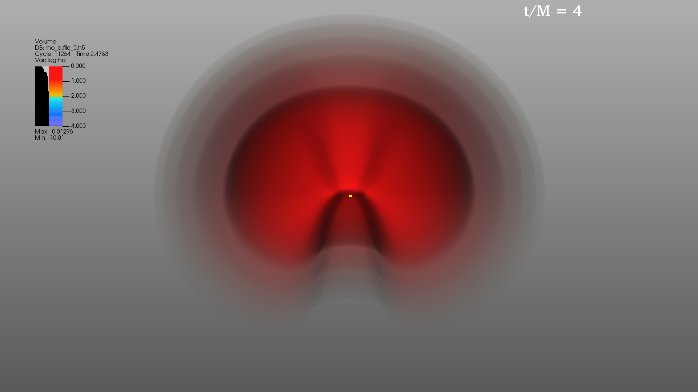

    
Figure 54: Base image of the BHD through volume rendering

In order to better understand the volume rendering process, we will visualize the BHD as seen
in 7.1 through volume rendering. To begin, we can set the viewing angle of the visualization and
create a base image to iterate our visualization. For more information on how to create a volume
rendering image, please refer to our previous section on volume rendering in Sec. 4.2.1.

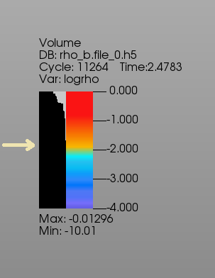

    
Figure 55: Distribution of freeformOpacity values

Although we can make out the shape of the disk, we need to
experiment with the settings to make the visualization better. For
instance, in Fig. 54, the entire BHD seems to be completely red even
though there is a vibrant colorbar used in the model. In order to improve
this behavior, we first look at the volume XML file used by VisIt that
controls the hyper-parameters associated with this visualization. From
here, we can see how the freeformOpacity of the visualization was
structured. As seen within the top left corner of the visualization beside
the colorbar, there seems to be a large bias towards the red region of
the visualization with very little opacity across the rest of the colorbar.
Modifying towards a wider distribution of the freeformOpacity values,
in order to better depict the entire colorbar across the BHD, we created the final visualization as seen in Fig 56.

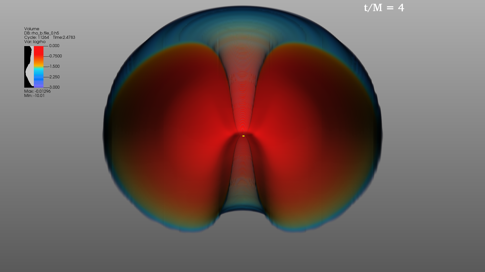

    
Figure 56: Final image of the BHD with volume rendering

## Magnetic Field Lines around the Black Hole

In addition to the plots mentioned in Sec. 7.2 we will also make an
<ul>
    <li><b>Integral curve</b> plot of the magnetic field seeded by grid seeds around the black hole.</li>
</ul>

Since we are interested in capturing the magnetic field around the black hole, we will be using grid
seeds that are placed above and below the poles of the black hole as described in Sec. 5.3.2. Since
we are using grid seeds, we are not visualizing individual magnetic field lines tied to particles and
tracking how they change. Rather, we are visualizing the shape of the magnetic field around the
black hole. See Fig. 43 for an example of magnetic field lines seeded by grid seeds in a BHD.

In our BHD initial data, the magnetic field exists only inside the accretion disk. Thus, the
vacuum in between the black hole and the disk contains no magnetic field. For this reason, integrating
grid seeds placed around the black hole before sufficient accretion has taken place will not draw field
lines, since the magnetic field will be zero in those regions. As the evolution proceeds and matter is
accreted from the disk onto the black hole, the magnetic field lines seeded around the black hole
will start to develop. Differential rotation of the matter due to frame-dragging causes the magnetic
field to wind up and form a helical structure above the poles. Since our aim is to best capture these
helical magnetic field lines above the black hole, we choose a late time after sufficient accretion has
taken place to use for magnetic field line experimentation.

To generate the grid seeds, we will use <b>seed maker.py</b> (Code Lst. 5.3.1). For grid seeds around
a black hole, it is helpful to define the (radius, height) pairs in terms of the average radius
r bh of the black hole horizon. Unless the mass of a black hole changes drastically (for example
in a binary black hole merger), it is okay to find r bh at a fixed time and use that value for the
entire remaining evolution. To find the value of r bh, we can use the h.t*.ah1.gp horizon data
which contains a list of points {(xi, yi, zi)} Ni=1 on the apparent horizon. Find the average of these
points (which is just the arithmetic mean (x, y, z) = 1&frasl;N &sum; Ni=i (xi, yi, zi)) to find the center of the
black hole. Then to find the average radius, we take the average distance of these points to the
center (<b>r_bh</b>= 1&frasl;N &sum; Ni=i &radic;
((xi − x)2 + (yi − y)2 + (zi − z)2)). Then we can draw rings with radii and
height that are ratios of r_bh (e.g. (r, h) = (0.6*r_bh, 1.1r_bh)).

Since we are dealing with a system where the black hole spin and the accretion disk angular
momentum are tilted with respect to each other and the disk is self-gravitating with a mass
comparable or even larger than the black hole mass, the black hole’s spin will precess. Therefore we
want the grid seeds to follow this precession, so we set up a script to automatically read the black
hole spin from the BHspin.mon file to the spins field in seed maker.py. We also need to track the
movement of the black hole by reading the location of the black hole from BH diagnostics.ah1.gp
file. In seed maker.py, we make an initial guess:

<ul>
    <li><b>centers</b> = [(x1, y1, z1)],</li>
    <li><b>pairs</b> = [(0.2*r bh, 1.8*r bh)],</li>
    <li><b>spins</b> = [(Jx bh, Jy bh, Jz bh)],</li>
    <li><b>num seeds per ring</b>= [10], and</li>
    <li><b>offsets</b> = [0.]</li>
</ul>

Here (x1, y1, z1) is the position of the center of the black hole read from BH diagnostics.ah1.gp,
r bh is the average radius of the horizon from the center, and (Jx bh, Jy bh, Jz bh) is the spin of
the black hole read from BHspin.mon. For the integration settings, we use the integrationType=Leapfrog
integrator with maxSteps=15000 and maxStepLength=1. We choose a small integration step size
since the magnetic field is very strong and twisting, so larger step sizes will cause the integrator
to step over details in the magnetic field. Additionally, as described in Sec. 5.3.2, we choose the
integrationDirection to make sure the field lines don’t integrate into the horizon. The resulting image is the left panel of Fig. 57. In this image, we use a Clip operator to get a meridional slice of
the isosurface density plot in order to get a better view of the magnetic field lines.

The resulting magnetic field lines show a helical shape and emerge from the poles of the black
hole. However, we would like to make the helix formed by the field lines a bit wider, if we can. The
jet may not be wider than this but if it is, we want to delineate that with our visualization. To do
this, we increase the radius of the ring (0.2*r bh→0.6*r bh) and decrease the height of the rings
(1.8*r bh→1.1*r bh). The resulting image is in the middle panel of Fig. 57.

Although we succeeded in increasing the width of the helix, it seems that we’ve increased the
ring’s radius by too much, resulting in field lines leaving the jet and penetrating the accretion disk.
Adjusting the ring’s radius by a bit, e.g. by choosing a radius 0.5*r bh and a height 1.6*r bh,
results in the image in the right panel of Fig. 57. This tightly wound helical magnetic field is our
optimal plot. Now we go back to the beginning of the evolution and fix our choices for (radius,
height) pairs. The rings will follow the movement of the black hole and the precession of the black
hole spin, while the helical field lines will slowly emerge as matter accretes onto it.

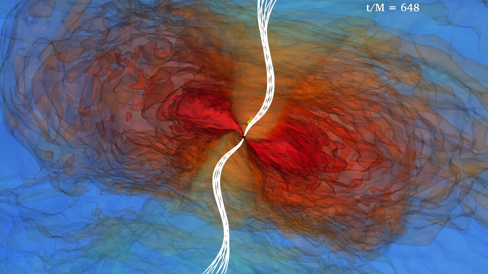

    
(a) Initial Guess

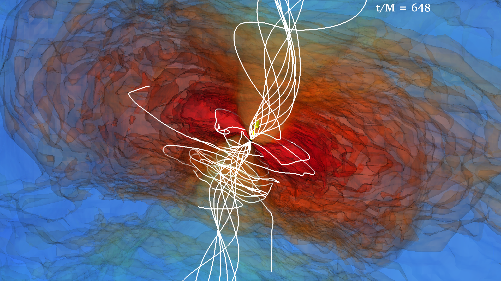

    
(b) After first change

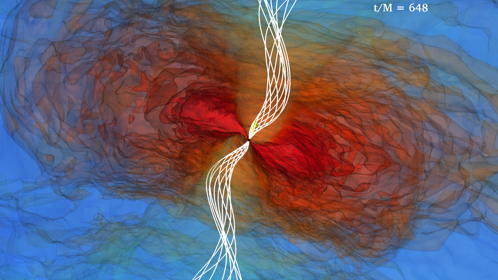

    
(c) After second change

    
Figure 57: Finding proper grid seeds for BHD magnetic field lines

## Visualizing a Relativistic Jet

As the BHD is evolved from its initial configuration, magnetized matter accretes onto the black
hole. After a while (a few hundred M), collimated magnetic field lines will develop above the black
hole poles (see Fig. 43 for an example). When this behavior begins, we suspect that a relativistic
jet may be forming and we need to make additional plots to confirm, or rule out the existence of a
jet. We will make the following plots:

<ul>
    <li><b>Isosurface</b> or <b>Volume</b> plot of log (ρ0&frasl;ρ0(0)), which will visualize the accretion disk.</li>
    <li><b>Pseudocolor</b> plot of the apparent horizon of the black hole.</li>
    <li><b>Vector</b> plot of the black hole spin.</li>
    <li><b>Integral curve</b> plot of the magnetic field seeded by grid seeds around the black hole poles.</li>
    <li><b>Isosurface</b> or <b>Volume</b> plot of log (b2&frasl;2ρ0). b2&frasl;2ρ0 is the force-free parameter which is
        one requirement of relativistic jet formation. In particular, one of the conditions for incipient
        jet formation is b2&frasl;2ρ0 ≫ 1, a feature of the Blandford-Znajek mechanism.</li>
    <li><b>Vector</b> plots of the velocity field in the jet area. Having a mildly relativistic outflow with
        ΓL ≳ 1.2 is another condition for jet formation.</li>
</ul>

The first four plots were made in previous sections. Using the grid seeds we found that once the
magnetic field lines wind in a helical shape, then we may be looking at a relativistic jet. In order to
further corroborate this, we need to make a volume plot of log (b2&frasl;2ρ0) and a vector plot of the
fluid velocity field.

The quantity b2&frasl;2ρ0 is the force-free parameter and its value is one of the indicators for
relativistic jet formation. In regions where this value is high, the magnetic field is strong and
the density is comparatively low, thus particles of matter are more easily accelerated outward to
relativistic speeds by the magnetic field. We plot the value log (b2&frasl;2ρ0) when we suspect a jet is
present. We actually define an ”incipient jet” based on the following three characteristics: 1) A
collimated, tightly wound magnetic field, 2) a mildly relativistic outflow (ΓL > 1.2), and 3) the
outflow is confined by a funnel containing a (nearly) force-free magnetic field b2&frasl;2ρ0 ≳ 10. As we
can see on the left panel of Fig. 58, an isosurface plot of the log (b2&frasl;2ρ0) shows that b2&frasl;2ρ0 is
between 10 and 100 (purple is between 1 and 2 in the colorbar of the log plot) around the winding
magnetic fields. We note that in such a jet, the flow will ultimately be accelerated to ΓL ≳ 100, but
this happens at radii beyond the outer boundary of our simulation.

A vector plot of the fluid velocity also helps confirm whether or not the fluid velocities in the
jet are actually (mildly) relativistic inside the magnetic funnel. Following the process described in
Sec. 5.4, we create a vector plot of the fluid velocity field. In these images, we choose only plot
vectors in regions where the log (b2&frasl;2ρ0) > −0.5 by using lines 11 and 12 in Code Lst. 5.4. Then
we apply a cylinder selection operator to only plot vectors in a cylinder centered around the jet.
The resulting image is shown in Fig. 58. A reference 0.5c vector is added to show the magnitude of
the velocity vectors. We can see that the velocities in the jet are relativistic.

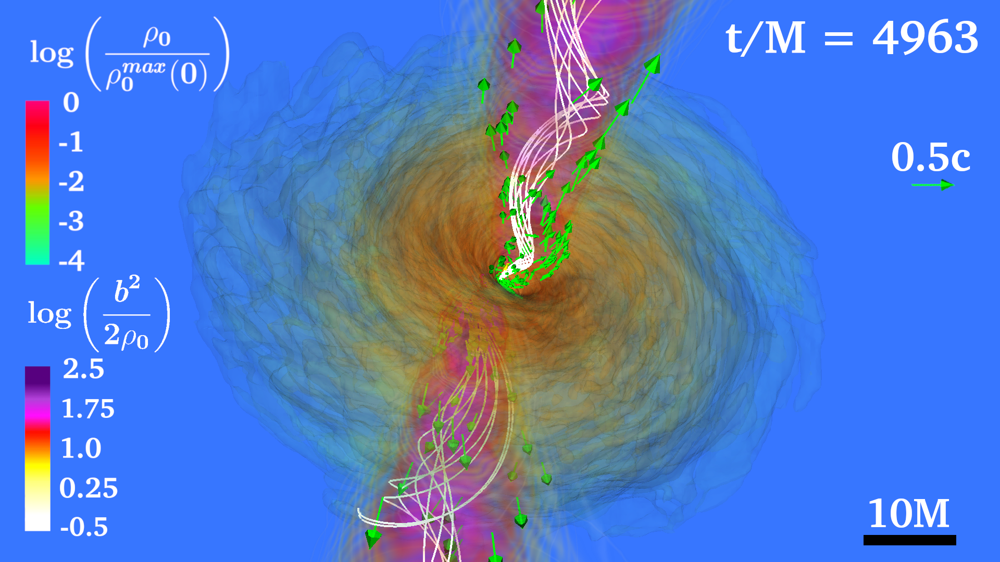

    
Figure 58: BHD jet with volume plot of log

