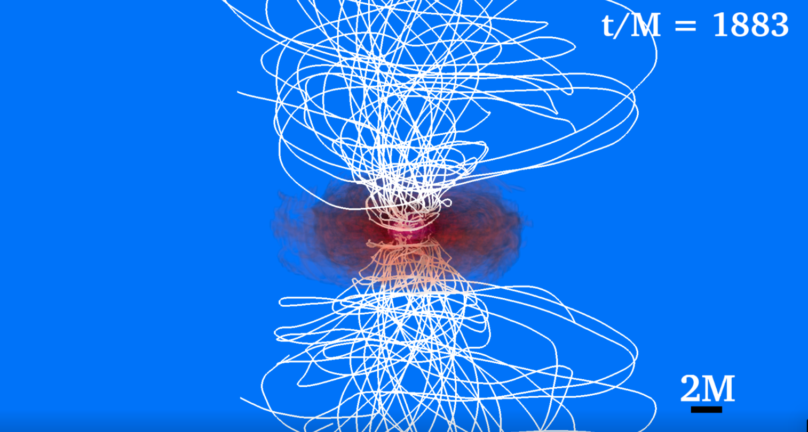

# Case Study: Binary Neutron Stars
The third case study will be the visualization of a binary neutron star system. Following event
GW170817, such binaries constitute prime candidates for multimessenger astronomy and therefore
visualizations of magnetized simulations are important. The figures that will be produced in this
section correspond to the simulations discussed in [6] and consist of mergers of identical irrotational
neutron stars with dipole-like magnetic fields extending outside the stars to infinity. We will use the
same techniques discussed in the case study of a single neutron star in Sec. 6. In addition, these
visualizations will also draw from techniques discussed in the case study of a BHD in Sec. 7 since
after the merger of two neutron stars, a black hole surrounded by an accretion disk usually forms.
These visualizations will use the following simulation output databases:

<ul>
    <li><b>rho b.file *.h5</b>: HDF5 data of the fluid rest-mass density ρ0</li>
    <li><b>Bx.file *.h5, By.file *.h5, Bz.file *.h5</b>: HDF5 data of the magnetic field</li>
    <li><b>particles.mon</b>: ASCII file containing the locations of a number of fluid particles</li>
    <li><b>vx.file *.h5, vy.file *.h5, vz.file *.h5</b>: HDF5 data of the magnetic field</li>
    <li><b>smallb2.file *.h5</b> HDF5 data of b2 ≡ b2/(4π) where B is magnetic field magnitude</li>
    <li><b>h.t*.ah1.gp</b>: Set of points on the apparent horizon of the remnant black hole (if it forms in the first place)</li>
</ul>

Using these databases, we will make visualizations across the entire evolution. In the case that we
will visualize, after the merger of the neutron stars, a hypermassive neutron star forms which will
eventually collapse into a black hole. We will split up the visualizations into two sections: pre-black
hole formation and post-black hole formation.

## Before Black Hole Formation

We will make the following plots before a black hole forms: 

<ul>
    <li><b>Isosurface</b> or <b>Volume</b> plot of log (ρ0&frasl;ρ0(0)), which will visualize the two neutron stars as well
        as the remnant hypermassive neutron star after the merger takes place.</li>
    <li><b>Integral curve</b> plot of the magnetic field lines seeded by particles inside the neutron stars.</li>
</ul>

Plotting the density follows the same procedure as the single neutron star case in Sec. 6. However,
it is worth pointing out that since the two neutron stars will eventually merge, we must consider the
range of densities across the entire evolution when thinking about our plots. After the merger, the
range of densities will be larger than the range of densities present prior to the merger. The highest
density of the remnant neutron star will be larger than the highest density of the original two stars
since the remnant has a larger mass. Additionally, the accretion disk that forms from debris around
the remnant will have densities much smaller than the densities of the neutron stars. Because of
this, it is a good idea to choose a color table by experimenting both with the initial data of two
neutron stars as well as post-merger data that contains an accretion disk and a remnant neutron
star. However, prior to the formation of the black hole (in the case that the remnant neutron star
collapses into a black hole), we keep the portion of the colorbar that corresponds to densities for
the accretion disk transparent so that the neutron stars can be seen clearly. After the black hole
has formed we want to bring out the accretion disk, so we increase the opacity of that part of the
colorbar. This transition is discussed in Sec. 8.2.

The process of finding good particle seeds for magnetic field lines is similar to that of a single
neutron star. However, since now there are two neutron stars, we pick a set of seed point (rings) for
each neutron star. The initial dipole-like magnetic field in these neutron stars has only poloidal
components in each star. From the diagnostic files, we find that at t = 0, the center of masses of
the two neutron stars are at

(x1, y1, z1) = (−12.5, 0.0, 0.0), and (x2, y2, z2) = (12.5, 0.0, 0.0).

Additionally, the radius of the neutron star is approximately ∼ 5.0 in code (G = c = M⊙ = 1) units.
Using this information, we can prepare an initial guess for seed points similar to what we have done
for the single neutron star case. There will of course be a similar process that involves tweaking our
seed point rings as well as the integration settings to perfect our visualization. The result of this
process are seed points that we generated using seed maker.py (Code Lst. 5.3.1) with

<ul>
    <li><b>centers</b> = [(-12.5, 0., 0.), (-12.5, 0., 0.), (12.5, 0., 0.), (12.5, 0., 0.)],</li>
    <li><b>pairs</b> = [(4., 3.), (0.9, 2.), (4., 3.), (0.9, 2.)],</li>
    <li><b>spins</b> = [(0., 0., 1.), (0., 0., 1.), (0., 0., 1.), (0., 0., 1.)],</li>
    <li><b>num seeds per ring</b> = [10, 10, 10, 10], and</li>
    <li><b>offsets</b> = [0., 0., 0., 0.].</li>
</ul>

For the integration settings, we settled on the <b>integrationType=DormandPrince</b> integrator with
maxSteps=50000 and maxStepLength=10. The rings of idealized seed points are shown on the
left-hand side of Fig. 59 and the magnetic fields drawn after choosing the nearest particle seeds are
shown on the right-hand side.

    
(a) Idealized seed points

    
(b) Field lines drawn with particle seeds

    
Figure 59: Particle seeded magnetic field lines in a binary neutron star.

As the neutron stars inspiral, we will continue using the particles we’ve chosen as seed points
for the magnetic field. Since the magnetic field lines are attached to the fluid matter, they will
follow the neutron stars as they orbit each other. Fig. 60 shows two images from a later time in
the simulation with the magnetic field lines seeded by our chosen particles. The image on the left
shows the moment the neutron stars merge and the image on the right shows the hypermassive [2]
neutron star remnant that forms after the merger.

    
(a) Moment when the two neutron stars merge.

    
(b) Remnant hypermassive neutron star

    
Figure 60: Evolution of binary neutron star with particle field lines.

The remnant hypermassive neutron star will eventually (sometimes immediately) collapse into a black hole. After the neutron star collapses into a black hole, there are some things we must change in our visualizations.

## After Black Hole Formation

After the merger and once the remnant hypermassive neutron star collapses to a black hole, we will
make the following plots:

<ul>
    <li><b>Isosurface</b> or <b>Volume</b> plot of log (ρ0&frasl;ρ0(0)), which will visualize the accretion disk. We change
        the colorbar of these plots compared to before black hole formation to emphasize the accretion
        disk.</li>
    <li><b>Pseudocolor</b> plot of the apparent horizon of the black hole.</li>
    <li><b>Integral curve</b> plot of the magnetic field seeded by grid seeds around the poles of the black hole.</li>
</ul>

After the hypermassive neutron star collapses to a black hole, most of the fluid matter will have
disappeared into the horizon. This means that the particles that we’ve been using to seed magnetic
field lines will also disappear into the horizon, so attempts to draw field lines using these particles
don’t make sense. As a result, if we visualize the system using the settings we use prior to black
hole formation, the resulting image will look rather empty (panel (b) of Fig. 61).

First of all, we will need to visualize the black hole. To visualize the horizon, we will use the
h.t*.ah1.gp horizon data and follow the directions in Sec. 5.1. At this moment we choose not to
draw a spin vector; however, it can be easily added using the same method described in Sec. 5.1.

To visualize the magnetic field, we will switch to using grid seeds that are placed above and
below the black hole poles as described in Sec. 5.3.2. Remember that since we are using grid seeds,
we are not visualizing magnetic field lines tied to particles and tracking how they change but rather
visualizing the shape of the magnetic field around the black hole at various instants. See Fig. 61 for
a closer look at the magnetic field seeded by grid seeds around the black hole.

We also increase the opacity of the lower density values on the colorbar to bring out the accretion
disk. If the fluid density is being rendered with a <b>Volume</b> plot, then this opacity transition can
be done by changing the freeFormOpacity parameter to increase the opacity of lower densities
(see Sec. 4.2.1, Sec. 7.2). If the fluid density is being rendered with an <b>Isosurface</b> plot, then this
opacity transition can be done by changing the minimum value min parameter to include shells
that correspond to lower densities (see Sec. 4.2.2, Sec. 7.1). The result of these settings can be
seen in Fig. 61(c). Notice the positions of the purple and the yellow/green on the colorbar. If the
yellow portion of the colorbar wasn’t transparent prior to the formation of the black hole, then the
hypermassive neutron star we are interested in would be obscured by lower densities. After the
black hole forms and most of the matter disappears into the horizon, we increase the opacity of the
lower density values since we are now interested in viewing the accretion disk.

    
(a) Initial data with colorbar

    
(b) Disk before changes

    
(c) Disk after changes

    
(d) Magnetic field seeded by grid points

    
Figure 61: Changes made after black hole formation

When creating a movie of the entire evolution, we stitch together movies of the evolution
constructed before and after black hole formation. During this transition, it is useful to add a slow
fade effect (on a ”dissolve”) when changing the opacity of the colorbars. This can be done outside of VisIt in the video editing software of our choice (e.g. Blender, Premiere Pro). As an example, go
to the 1:00 mark in the video:

  <a href="https://www.youtube.com/watch?v=Bh7otUA78KE">https://www.youtube.com/watch?v=Bh7otUA78KE</a>

 

## Additional Plots After Merger

In addition to the visualizations of the entire evolution before and after the black hole formation,
we will also create some additional visualizations after the merger to assess the potential formation
of a relativistic jet. In addition to the plots made on Sec. 8.1, 8.2 we will also plot the following

<ul>
    <li><b>Isosurface</b> or <b>Volume</b> plot of log (b2&frasl;2ρ0).</li>
    <li><b>Vector</b> plots of the velocity field in the jet area.</li>
</ul>

If the magnetic field lines seeded by grid seeds around the black hole form a helical winding pattern
as they do in the bottom panel of Fig. 61, then we may be looking at an incipient relativistic jet.
In order to further investigate this, we will make a volume plot of log (b2&frasl;2ρ0) and a vector plot of
the fluid velocity field.

As discussed in Sec. 7.4, the quantity b2&frasl;2ρ0 is the force-free parameter and its value is one of
the indicators for relativistic jet formation. As we can see on the left panel of Fig. 62—which is at
a time of 1761M after the black hole forms—a volume plot of the log (b2&frasl;2ρ0) shows that b2&frasl;2ρ0 is between 10 and 100 (purple is between 1 and 2 in the colorbar of the log plot) in a cylindrical
region above the black hole poles. At the same time the magnetic field lines form a tightly wound
funnel which is magnetically dominated.

A vector plot of the fluid velocity also helps confirm whether or not the fluid velocities in the jet
are actually (mildly) relativistic. Following the process described in Sec. 5.4, we create a vector plot
of the fluid velocity field. In these images, we choose to only plot vectors with magnitudes greater
than 0.5c by using line 3 in Code Lst. 5.4. Then we apply a cylindrical selection operator to plot
vectors only in a cylinder centered around the jet. The resulting image is the right panel of Fig. 62.
Since the vectors are scaled by magnitude, once a reference 0.5c vector is depicted, we can see that
the velocities around the jet are relativistic.

    
(a) Volume plot of log (b2&frasl;2ρ0)

    
(b) Vector plot of the velocity field

    
Figure 62: Additional plots to confirm the existence of an incipient jet

