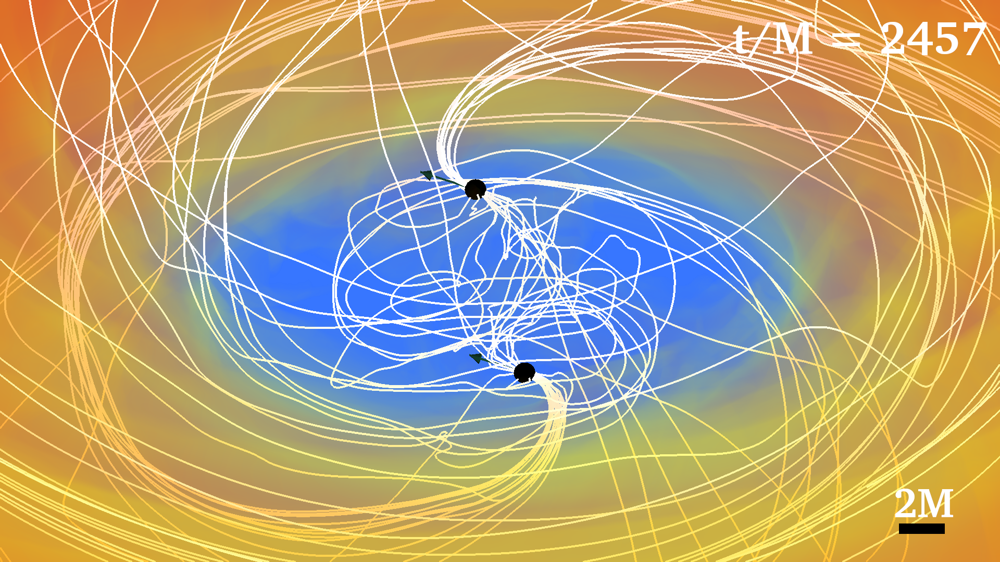
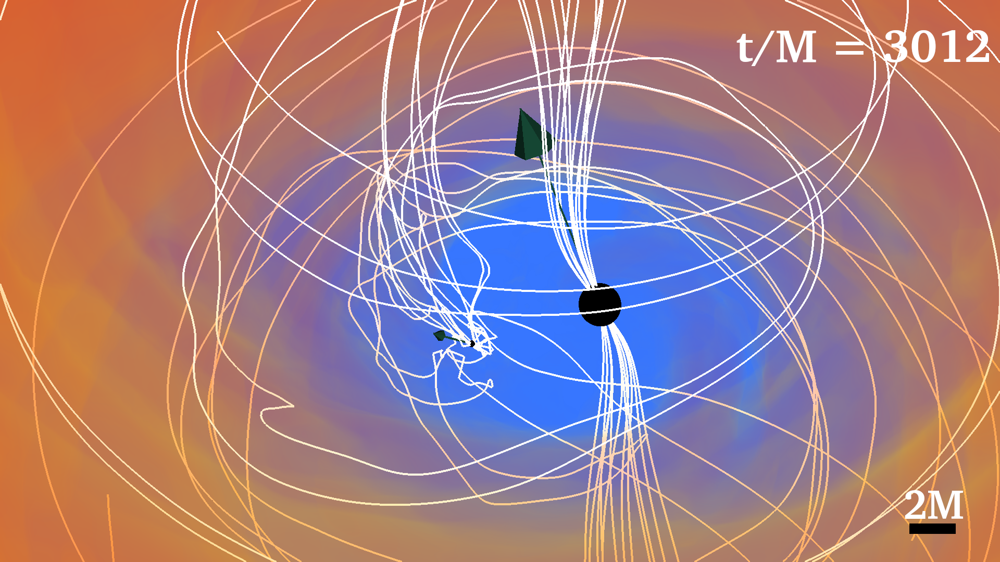

# Case Study: Binary Black Hole with Accretion Disk
The fourth case will study the visualization of a binary black hole system surrounded by a magnetized
accretion disk (BBHD). These BBHDs correspond to the simulations discussed in [7]. In these
cases, the spins of the black holes are tilted with respect to the orbital angular momentum. The
visualizations we will make of these BBHDs will use techniques discussed in all of the earlier case
studies. We will use the following simulation output databases:

<ul>
    <li><b>rho b.file *.h5</b>: HDF5 data of the fluid rest-mass density ρ0</li>
    <li><b>Bx.file *.h5, By.file *.h5, Bz.file *.h5</b>: HDF5 data of the magnetic field</li>
    <li><b>particles.mon</b>: ASCII file containing the locations of a number of fluid particles</li>
    <li><b>vx.file *.h5, vy.file *.h5, vz.file *.h5</b>: HDF5 data of the magnetic field</li>
    <li><b>h.t*.ah1.gp, h.t*.ah2.gp, h.t*.ah3.gp</b>: Set of points on the apparent horizon of the two
        black holes in the binary (ah1 and ah2) and the remnant black hole (ah3).</li>
    <li><b>Set of points on the apparent horizon of the two black holes in the binary (ah1 and ah2) and the remnant black hole (ah3).</b>: ASCII black
        hole diagnostic file containing information about the location of the two black holes in the
        binary (ah1 and ah2) and the remnant black hole (ah3).</li>
    <li><b>BHspin.ah1.mon, BHspin.ah2.mon, BHspin.ah3.mon</b>: ASCII file containing the spin vector
        data of the two black holes in the binary (ah1 and ah2) and the remnant black hole (ah3)</li>
</ul>

Since the BBHDs have a lot of similarities with BHDs (Sec. 7), the visualizations we will make are
very similar:

<ul>
    <li><b>Volume</b> plot of log (<sup>ρ0</sup>&frasl;<sub>ρ0(0)</sub>), which will visualize the accretion disk.</li>
    <li><b>Pseudocolor</b> plot of the apparent horizon of the black holes.</li>
    <li><b>Vector</b> plot of the black hole spins.</li>
    <li><b>Integral curve</b> plot of magnetic field seeded by grid seeds around the black holes.</li>
    <li><b>Integral curve</b> plot of magnetic field seeded by particles inside the disk.</li>
</ul>

The volume plot of log (<sup>ρ0</sup>&frasl;<sub>ρ0(0)</sub>) follows the same procedure described in Sec. 7.2. Here, we are using
a different colorbar with fewer colors since we aren’t trying to emphasize the structure of the disk
with our visualizations (see Fig. 64 for the colorbar).

## Magnetic Field Lines in the Disk

We will start by drawing the magnetic field lines seeded by particles inside the disk. This follows a
similar procedure that we used to draw magnetic field lines inside the rotating neutron stars in Sec.
6. The difference here is that the structure of a disk (a toroid) is different from that of a neutron
star (an ellipsoid). So in order to place particles inside the disk, we must choose the radius and
height of our ring of seed points with some thought. If we create a 2D plot of the xz-slice of the
rho b density database (Fig. 63), we can see estimate the inner radius rin, the outer radius rout,
and the height hdisk of the disk. The colorbar in the 2D plot is the density normalized by the initial
max density. If we take the disk to be the regions where the disk density is not zero (the dark blue),
we estimate that rin ≈ 25, rout ≈ 150, and hdisk ≈ 50 in code units (G = c = M⊙ = 1). For an initial guess to use in seedmaker.py (Code Lst. 5.3.1), we choose a pair (r, h) with rin < r < rout
and h < hdisk. Note that the center of mass of the disk is at the origin and that its magnetic field is
poloidal with respect to the z axis. Our final seed points end up being

<ul>
    <li><b>centers</b> = [(0., 0., 0.)]</li>
    <li><b>pairs</b> = [(90, 10)]</li>
    <li><b>spins</b> = [(0., 0., 1.)]</li>
    <li><b>num seeds per ring</b> = [12]</li>
    <li><b>offsets</b> = [0.]</li>
</ul>


<div style="text-align: center;">
    <p>Figure 63: 2D xz-slice of the density data.</p>
</div>

using the Leapfrog integrator with maxSteps=2200 and maxStepLength=300. Remember that
we pick particles from paritcles.mon that are closest to our chosen seed points and drawn the
magnetic field lines from these particles for the entire evolution. The field lines drawn using these
particles and integration settings at the first time as well as a time later on in the evolution are
shown in Fig. 64. Notice how the magnetic field lines twist at the later time due to the differential
rotation of the accretion disk.


<div style="text-align: center;">
    <p>(a) Initial Data</p>
</div>


<div style="text-align: center;">
    <p>(b) Later Time</p>
</div>

<div style="text-align: center;">
    <p>Figure 64: Magnetic field lines inside accretion disk</p>
</div>


## Two Black Holes

Next, we will discuss the main difference between BHDs and BBHDs. In particular, we will be
working with three sets of black hole data. Two sets correspond to the two black holes in the original
binary black hole system and another one corresponds to the remnant black hole after the merger.
Even though there are three sets of data, there will only be a maximum of two black holes present
in our visualizations. That is, data for the two black holes in the binary will not be plotted at
frames where data for the remnant black hole exist. After merger, when we have a single black hole,
the plots will be the same as the plots made of BHDs in Sec. 7 and of the remnant black hole in the
NSNS merger in Sec. 8. So in this section, we will focus on visualizing BBHDs prior to merger.

Before the merger, we are working with two sets of black hole data. To start, we will process
the h.t*.ah1.gp and h.t.ah2.gp files into bh1 *.3d and bh2 *.3d files as described in 5.1. Make
sure to use a separate variable name in the fourth column of the .3d files (the variable name is
bh1p in Code Lst. 5.1) to differentiate between the two black holes in VisIt (for example, bh1p and
bh2p). Then plotting the horizon for each black hole involves creating two separate Pseudocolor
plots. For example, after opening up the two .3d databases, we can create two separate plots using
Code Lst. 9.2.

```vtk
1 ActivateDatabase("/path/to/bh1.3d")
2 AddPlot("Pseudocolor", "bh1p") #plot index 0
3 SetActivePlots(0)
4 ... #apply pseudo options
5 ActivateDatabase("/path/to/bh2.3d")
6 AddPlot("Pseudocolor", "bh2p") #plot index 1
7 SetActivePlots(1)
8 ... #apply pseudo options
```
Code Listing 9.2: <code>Creating two black hole plots</code>
{: style="text-align: center;"}


<div style="text-align: center;">
    <p>Figure 65: Plotting Two Black Holes and Spin Vectors Example</p>
</div>

Similarly, we will process BHspin.ah1.mon and BHspin.ah2.mon into spin vec1.vtk and
spin vec2.vtk files, making sure to use different variable names (the variable name is spinvec
in Code Lst. 5.1). Then we create two separate Vector plots. When applying the box operator
to the Vector plots to center the spin vector on the black hole, remember to use the location
from the respective black hole. Recall that this can either be acquired from the correct row of the
BH diagnoistics file or by taking the average of all the points in the .3d file. The spin vector
data in the BHspin.mon files contain information about the spin magnitude as well, so as long as
the vector plots for each black hole are scaled with the same scaling factor, the plot will correctly
reflect the magnitude. Below in Fig. 65, we show the initial data for the BBHD where the black
holes have a 2:1 mass ratio and the spins are tilted 45◦ above the orbital plane. Now we will discuss visualizing the magnetic field lines seeded by grid points around each black hole. Remember in the
BHD case (Sec. 7.3), we created rings of seed points above and below the black hole with respect
to the black hole spin that follow changes in the black hole’s spin and position. It is even more
important for the rings to follow the black holes in the BBHD case since the black holes orbit each other. 
Like with the BHDs, for each black hole, we create rings of points by choosing (radius,
height) as fractions of the average black hole radius r bh (which is calculated for each black hole
as described in 7.3). After experimentation, we found that using (r, h) = (0.5*bh r, 1.5*bh r)
works well. From previous steps, we already know the centers of the two black holes (x1, y1, z1)
and (x2, y2, z2) (from either the BH diagnostic files or the .3d files we created). We also know
the spins of the black holes (Jx bh1, Jy bh1, Jz bh1) and (Jx bh2, Jy bh2, Jz bh2). from the
BHspin.mon files. For the first black hole, we set the fields in seed maker.py to

<ul>
    <li><b>centers</b> = [(x1, y1, z1)]</li>
    <li><b>pairs</b> = [(0.5*bh1 r, 1.5*bh1 r)]</li>
    <li><b>spins</b> = [(Jx bh1, Jy bh1, Jz bh1)]</li>
</ul>

and likewise for the second black hole

<ul>
    <li><b>centers</b> = [(x2, y2, z2)]</li>
    <li><b>pairs</b> = [(0.5*bh2 r, 1.5*bh2 r)]</li>
    <li><b>spins</b> = [(Jx bh2, Jy bh2, Jz bh2)]</li>
</ul>

We’ve left out the num seeds per ring parameter since the best choice depends on the mass of the
black hole. For example, in the 1:1 mass ratio case, we choose to set this parameter to 8 for each
black hole. However, for the 4:1 mass ratio case, we choose to only use 4 per ring for the smaller
black hole (still having 8 seeds per ring for the larger one). Below in Fig. 66, we show magnetic
fields seeded by grid points around the black holes for the 1:1, 2:1, and 4:1 mass ratio binary BHD
cases.


<div style="text-align: center;">
    <p>(a) 1:1 Mass Ratio</p>
</div>


<div style="text-align: center;">
    <p>(b) 2:1 Mass Ratio</p>
</div>


<div style="text-align: center;">
    <p>(c) 4:1 Mass Ratio</p>
</div>

<div style="text-align: center;">
    <p>Figure 66: Magnetic field lines around black holes in a black hole binary system.</p>
</div>